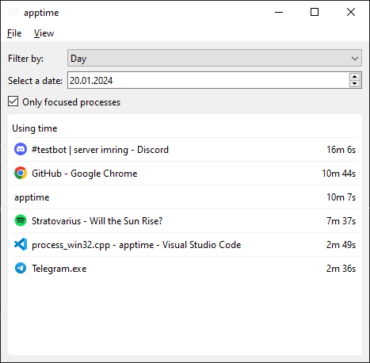

# apptime
apptime is a program for tracking application uptime.



## Features
- [x] **Statistics view**: you can view statistics about the time spent in different applications;
- [x] **Filtering**: you can remove unnecessary applications to track uptime;
- [ ] **Data Import/Export**: you can export your application usage time data;
- [ ] **Settings**: you can configure program parameters such as monitoring periods and other settings.

## Building
Requirements:
- Compiler with C++20 support;
- [CMake 3.20+](https://cmake.org/);
- [Qt 6](https://www.qt.io/);

```bash
git clone https://github.com/imring/apptime
cd apptime
cmake . -B build
cmake --build build
```